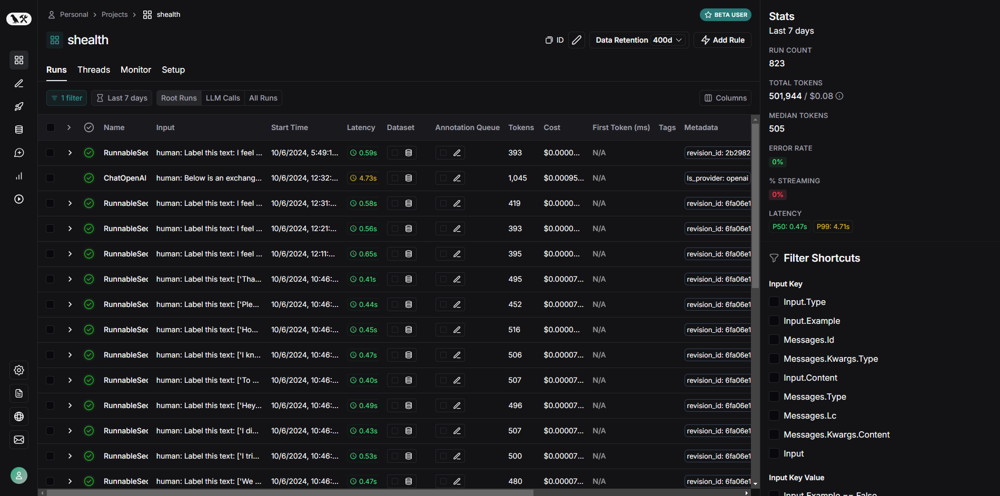
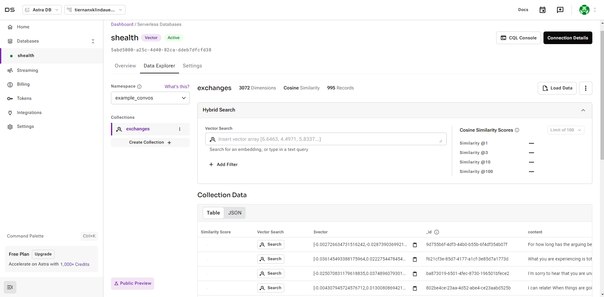

# sHealth Backend

## Overview

Welcome to the sHealth Backend project! This project is designed to assist patients in discussing sensitive topics such
as suicide. It features a chatbot that facilitates conversations and a machine learning model that classifies patient
behavior/actions into one of the following categories: `Attempt`, `Behavior`, `Ideation`, `Indicator`, `Supportive`.

## Directory

- [Features](#Features)
- [Dataset](#dataset)
- [Dataset Analysis](#dataset-analysis)
- [Installation](#installation)
- [Helper Scripts](#helper-scripts)
- [API Endpoints](#api-endpoints)
- [Technologies Used](#technologies-used)
- [Contributing](#contributing)
- [License](#license)

## Features

- **Chatbot Assistant**: Helps patients talk about their feelings and thoughts.
- **ML Classification**: Classifies patient messages into predefined categories to better understand their mental state.
- **Mental Health DB**: A searchable database of anonymized mental health care interactions to reference. Uses AstraDB +
  vector-search.
- **User Authentication**: Secure user registration and login using JWT.
- **Database Integration**: Stores chat history and user data in a PostgreSQL database.
- **RESTful API**: Provides endpoints for chat, classification, and user management.

## Dataset

The dataset used for training the ML model comprises conversations from 500 Reddit users discussing suicide. The data
has been preprocessed and labeled into the following categories:

- **Attempt**: Indications of a suicide attempt.
- **Behavior**: Behaviors associated with suicidal thoughts.
- **Ideation**: Expressions of suicidal thoughts or plans.
- **Indicator**: Signs that may indicate suicidal tendencies.
- **Supportive**: Messages providing support and encouragement.

The dataset is public and can be found [here](https://zenodo.org/records/2667859#.YCwdTR1OlQI).

The ML model classification results can be
found [here](static/Reddit%20Suicide%20Post%20Dataset%20Classification%20Prediction.pdf).

All models used in the ensemble must be trained before use.

<br>
The dataset used for the searchable mental health DB

**NOTE: THERE ARE SIGNIFICANT ISSUES WITH THE DATASET AS-IS. A FIXED VERSION OF THIS DATASET
IS [HERE](data/500_Reddit_users_posts_labels.csv)**

### Dataset Analysis

You can find a detailed analysis of the dataset in the following PDF (generated from `analysis\analysis.py`):

[Reddit Suicidal Post Dataset Analysis](static/Reddit%20Suicidal%20Post%20Dataset%20Analysis.pdf)

## Installation

1. Clone the repository:
    ```bash
    git clone https://github.com/T-Lind/sHealth-Backend.git
    cd sHealth-Backend
    ```

2. Create and activate a virtual environment:
    ```bash
    python -m venv venv
    source venv/bin/activate  # On Windows use `venv\Scripts\activate`
    ```

3. Install the required packages:
    ```bash
    pip install -r requirements.txt
    ```

4. Set up the environment variables:
    - Create a `.env` file in the root directory.
    - Add the following variables:
        ```
        DATABASE_URL=your_database_url
        JWT_SECRET_KEY=your_jwt_secret_key
        OPENAI_API_KEY=your_openai_api_key
        ENDPOINT_VERSION=v1
      
        LANGCHAIN_TRACING_V2=true
        LANGCHAIN_ENDPOINT="https://api.smith.langchain.com"
        LANGCHAIN_API_KEY="ls__93..."
        LANGCHAIN_PROJECT="project-name"
      
        ASTRA_DB_API_ENDPOINT=https://your_astra_db_api_endpoint.astra.datastax.com
        ASTRA_DB_APPLICATION_TOKEN=AstraCS:your_astra_db_application_token
      
        ```

      FOR THESE VALUES, PLEASE CONTACT ME.

5. Run the application:
    ```bash
    python app.py
    ```

## Helper Scripts

Apart from the main application, there are many other programs that perform analysis or other useful functions:

- `analysis/analysis.py`: Analyzes the dataset of Reddit posts, including post length, classification distribution,
  sentiment,
  semantic grouping analysis, and so on. Useful when classifying via classical methods.
- `analysis/train_bert.py`: Trains a BERT model on the dataset to classify posts into the predefined categories.
- `analysis/train_longformer.py`: Trains a Longformer model on the dataset to classify posts into the predefined
  categories.
- `analysis/evaluate_bert.py`: Evaluates the BERT model on the validation set.
- `analysis/train_ensemble.py`: Trains an ensemble model using the BERT, sentiment prediction, and LLM models.

## API Endpoints

### User Management

- **Register**: `POST /api/v1/register`
- **Login**: `POST /api/v1/login`

### Chat

- **Send Message**: `POST /api/v1/chat`
- **Get Chat History**: `GET /api/v1/chat-history`
- **Clear Chat History**: `POST /api/v1/clear-chat`

### ML Predictions

- **Generate Prediction**: `POST /api/v1/ml-predictions`

## Technologies Used

- **Python**: Core programming language.
- **Flask**: Web framework for building the API.
- **PostgreSQL**: Database for storing user and chat data.
- **LangChain**: For handling chat messages.
- **Langsmith**: For logging and analyzing LLM usage.
- **Transformers**: For the ML model.
- **JWT**: For secure user authentication.

### Langsmith

LangSmith is more obscure, so this section provides a brief overview and resources.
LangSmith is a comprehensive platform developed by LangChain to assist developers in building, debugging, and managing
production-grade LLM applications.

Here's it in use for this project:


For more information visit https://smith.langchain.com/.

## AstraDB

AstraDB is a cloud-native database-as-a-service built on Apache Cassandra. It is used in this project to store the
vector embeddings in an efficient and cost-effective way. Loading data is very easy and they have many examples, incld

Here's what my AstraDB database dashboard looks like:



## Contributing

Contributions are welcome! Please fork the repository and submit a pull request.

## License

This project is licensed under the MIT License.

---

Developed by T-Lind.